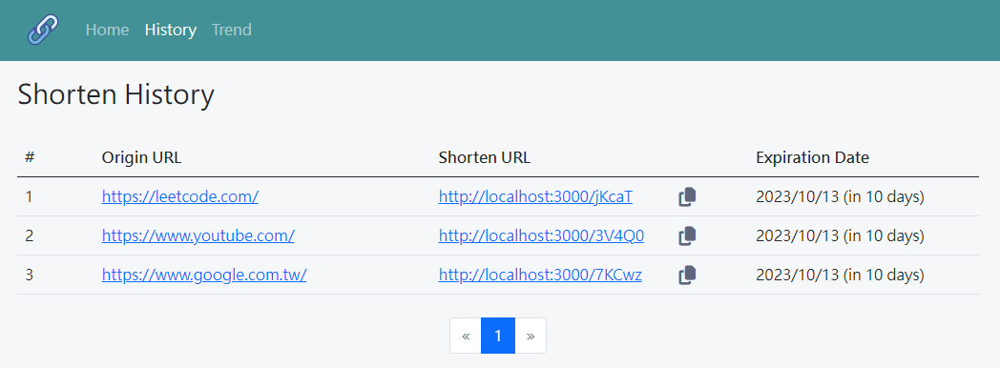

# URL Shortener－縮網址
> 一鍵轉換成縮網址，讓版面變得更簡潔！


## 功能介紹
1. Home頁籤：使用者能進行縮網址的轉換，並取得QR Code。
2. History頁籤：使用者能查看歷史紀錄，如原始網址、縮網址及有效時間等。
3. Trend頁籤：**施工中。**

## 環境建置與需求
1. Node.js
2. MongoDB
3. 環境檔(.env)

## 專案安裝與執行步驟
1. 將此專案clone到本地。
2. 開啟終端機，在專案資料夾執行：
```bash
cd [filePath]  # [filePath]為專案資料夾的路徑
npm init -y
```
3. 在終端機安裝套件(請見**package.json**的`dependencies`和`devDependencies`)：
```bash
# 安裝dependencies的套件
# 以"express": "^4.17.1"為例，執行
npm install express@4.17.1
```
```bash
# 安裝devDependencies的套件
# 以"dotenv": "^16.0.3"為例，執行
npm install -D dotenv@16.0.3
```
4. 環境檔－在目標資料夾新增副檔名為**env**的檔案，設定DB連線。
私密資訊皆紀錄在**env.example**。
```javascript
// .env的內文
MONGODB_URI=[yourSecret] // [yourSecret]為您的私密資訊
```
5. 在終端機啟動伺服器，成功或失敗皆會有通知訊息。
```bash
# 啟動方法1
npm run start (node app.js)
```
```bash
# 啟動方法2
npm run dev (nodemon app.js)
```
6. 在瀏覽器輸入http://localhost:3000 ，即可連線。

## 相關畫面
- 取得短網址畫面


- 查看歷史畫面
